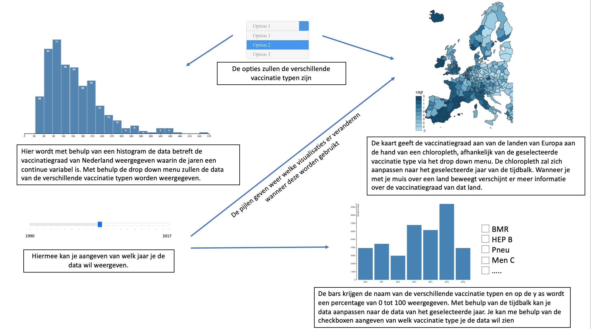

# Design document

## Externe databronnen 
Nederland 
Voor meer uitgebreide data van Nederland: 
https://www.volksgezondheidenzorg.info/onderwerp/vaccinaties/cijfers-context/trends#node-trend-vaccinatiegraad-zuigelingen 

Deze data is een vrij eenvoudige dataset die veel interessante informatie weergeeft om visueel goed trends te kunnen weergeven. Ik heb getracht om deze dataset via een CSV te kunnen uploaden. Helaas kon ik hier geen link voor vinden. Door de grootte van de dataset heb ik voor gekozen om de dataset via de copy paste functie in een Excel weer te geven

Europa 
Voor data over Europa worden den volgende databases gebruikt: 
http://apps.who.int/gho/data/node.main.A824?lang=en 
Hiervan worden de volgende 4 dataset gebruikt:
-	Diphtheria tetanus toxoid and pertussis (DTP3)
-	Hib (Hib3)
-	Hepatitis B (HepB3)
-	Pneumococcal conjugate (PCV3)

Deze data bevat informatie over de vaccinatiegraad van alle landen van de wereld. Voor de relevantie van het onderzoek zullen hier alleen de landen van Europa uitgefilterd met de bijbehorende data. Vervolgens wordt de CSV omgezet in een JSON waarbij de landen als index dienen.

Helaas was er niet voor elk vaccinatie type die ook in de dataset van Nederland voorkwam ook informatie van de landen van Europa beschikbaar.

## Elements 
### Chloropleth 
-	Om de kaart van Europa weer te geven, zal ik gebruik maken van de d3 plug-in D3GeoProjection. Hiermee zal een kaart worden weergegeven. 
-	Met behulp van d3.scale zullen de thresholds worden bepaald waarmee de landen in de kaart worden ingekleurd. Hierbij wordt ook een geschaalde legende weergegeven aan de zijkant van de kaart. 
-	Met behulp van een tooltip functie kan er informatie over het geselecteerde land worden weergegeven.
-	Met behulp van een slider kan je aanpassen van welk jaar de data wil hebben weergegeven.

### Slider 
-	Met behulp van de slider kan je een jaar kiezen waarvan je je data wil weergeven.
-	De slider veranderd de data van zowel de chloropleth als dat van de bar chart

### Histogram 
-	De x-as geven de jaren weer en de y-as een percentage van 0-100%
-	De data wordt aangepast afhankelijk van de geselecteerde vaccinatie type via het drop down menu
-	Ook hier zal een tooltip meer informatie weergeven van de geselecteerde bar

### Drop down menu 
-	Geeft keuze uit de verschillende vaccinatie typen
-	Beinvloed de weergave van data van zowel het histogram als dat van de chloropleth

### Bar chart 
-	Geeft data weer van het geselecteerde land in de chloroplath
-	De bars geven de verschillende vaccinatie typen met de bijbehoren vaccinatiegraad weer
-	Met behulp van check boxen kan je selecteren van welke vaccinatietypen je wil weergeven in de bar chart. Bij default staan alle boxen aangevinkt
-	Met behulp van een slider kan ook hier de data van verschillende jaren worden getoond

## Tools 
D3 plugins 
-	D3GeoProjection of D3.geomap
-	D3.scale 
HTML 5 tags:
-	Input type=range 
http://thenewcode.com/757/Playing-With-The-HTML5-range-Slider-Input 
-	Input type=checkbox

## Project design

