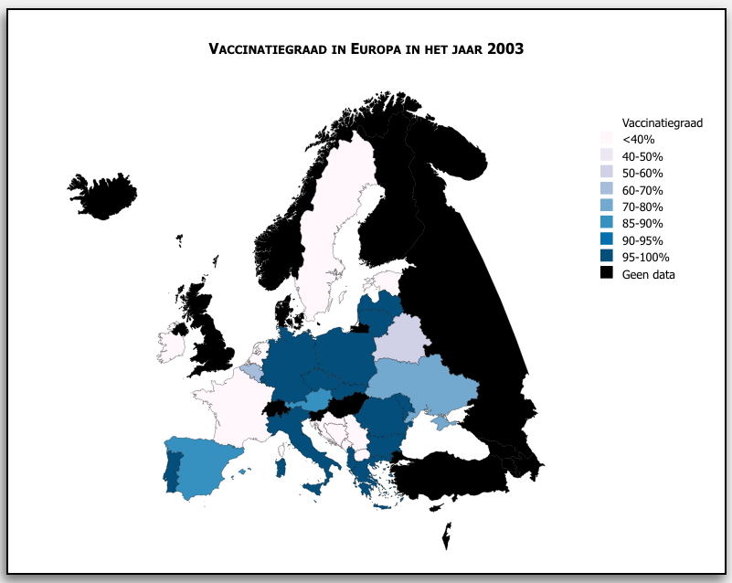
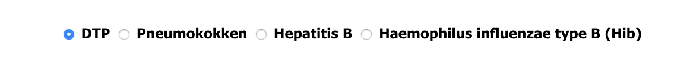
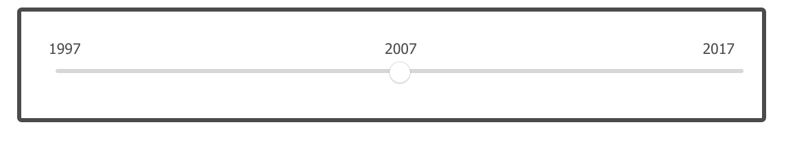
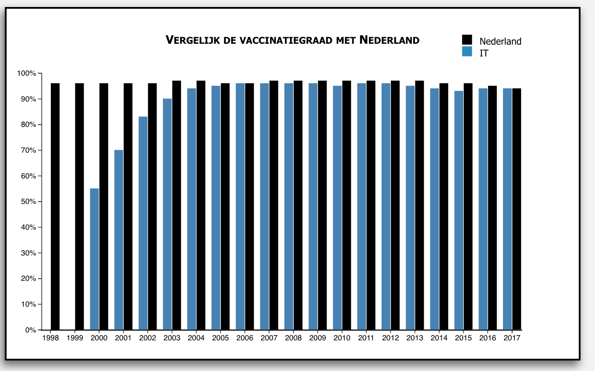
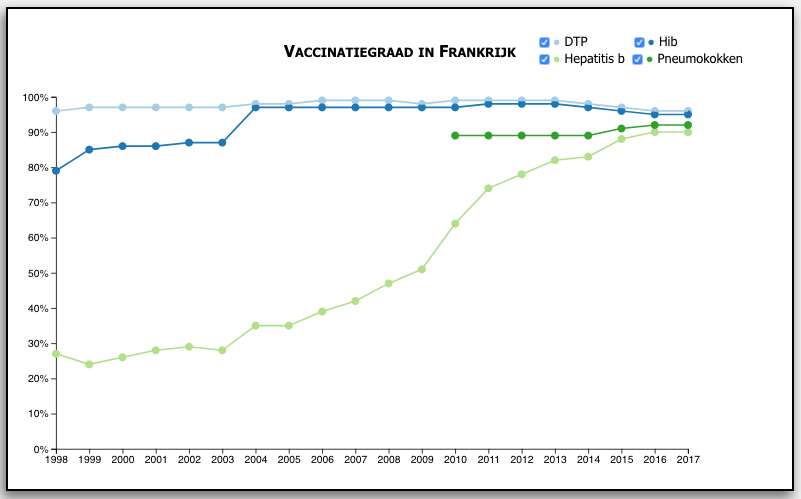

Project van Amber Nobel
============
**Application goals:** 
Met deze website kan je zien hoe de vaccinatiegraad door de jaren heen is toegenomen. Ervan uitgaande dat de WHO streeft naar een vaccinatiegraad van 95%, is er nog veel winst in te halen. Met deze visualisaties kan je de ontwikkeling van de vaccinatiegraad bekijken van verschillende landen van verschillende vaccinatie typen door de jaren heen.

**Doel** 
Vaccineren lijkt de laatste tijd weer een veel besproken onderwerp in Nederland. Mensen trekken in twijfel of de vaccinaties wel doen wat ze moeten doen of dat ze zelfs bepaalde ziektes kunnen veroorzaken. Dit heeft geleid tot een afname in vaccinatiegraad in Nederland, met als gevolg dat de groepsimmuniteit daalt. De WHO streeft ernaar om een vaccinatiegraad van 95% te bereiken om enigszins groepsimmuniteit te kunnen garanderen. Wanneer deze vaccinatiegraad lager is dan 95% kan dit als gevolg hebben dat mensen elkaar makkelijker kunnen besmetten en er steeds meer gevallen van bijvoorbeeld de mazelen in Nederland worden gerapporteerd.

De visualisatie zal een beeld schetsen van de vaccinatiegraad van 4 verschillende vaccinatie typen in Europe. De data die is gebruikt voor deze visualisatie is afkomstig van de [database](http://apps.who.int/gho/data/node.main.A824?lang=en) van het WHO (World Health organisation).

Aan de hand van deze data kunnen we een beeld schetsen van de vaccinatiegraad van Nederland tegenover die van andere landen in Europa. De ontwikkeling van het invoeren van vaccinaties zullen ook zichtbaar worden door de stijging van de vaccinatiegraad. De visualisatie zal ook een beeld schetsen van de weg die we hebben af te leggen om de gewenste vaccinatiegraad van 95% te bereiken.

**Visualisatie** 
The choropleth geeft de kaart van Europa weer met hierin de vaccinatiegraad weergegeven aan de hand van een legende. De vaccinatiegraad van de geselecteerde radio button wordt weergegeven. Met behulp van de range slider kan er een trend worden gezien over de jaren heen. Hoe donkerder de landen ingekleurd zijn, hoe hoger de vaccinatiegraad. Wanneer je met de muis over een land op de kaart gaat komt er in het wolkje informatie te staan over de vaccinatiegraad, het jaar en het land. Je kan in de choropleth een land aanklikken waardoor zowel de grouped bar chart en de line graph hierop zullen aanpassen.

Voor de visualisatie om de vaccinatiegraad van Nederland te vergelijken met een ander land wordt er een grouped bar chart gecreëerd. Deze bar chart geeft de vaccinatiegraad weer over de tijd vergeleken met een ander Europees land dat is geselecteerd via de choropleth. Je kan de data aanpassen door een ander land te selecteren en door met behulp van radio buttons een vaccinatiegraad te selecteren.

De line chart zal de vaccinatiegraad over de jaren heen weergeven van het geselecteerde land van de choropleth. In de visualisatie zullen checkboxen weergegeven zijn. Hierdoor kan je aanklikken voor welke vaccinatietypen weergegeven wil hebben. Hierdoor kan je goed de verschillende trends vergelijken van verschillende vaccinatietypen.

**Benodigde talen en libraries** 
Voor het creëren van dit project heb zal ik gebruik maken van Javascript, HTML, Python, CSS en als extra library D3 en de functie om topojson te kunnen gebruiken

**Uitdagende elementen** 
Het lastigste dat ik tegen zal komen is het creëren van choropleths die ook nog eens informatie kunnen weergeven met behulp van de huidige informatie over d3 op het internet. Ook zullen de vele interactieve elementen een uitdaging zijn om de juiste data weer te geven. Ik heb bijvoorbeeld nog niet eerder met een tijdlijn functie gewerkt en het interactieve aspect ervan.
